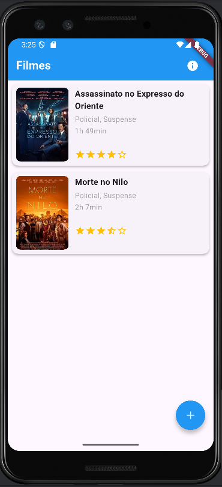
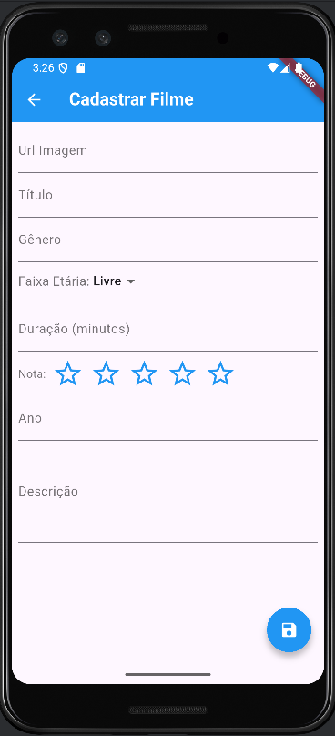
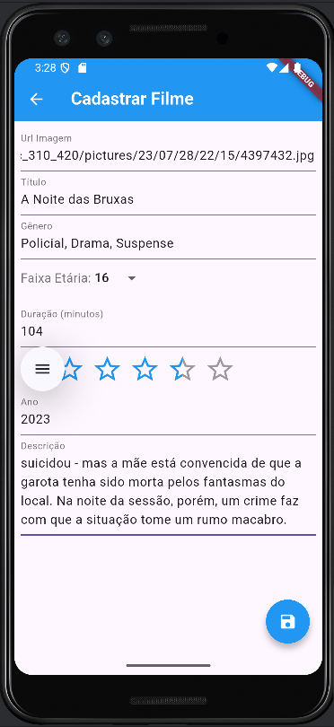
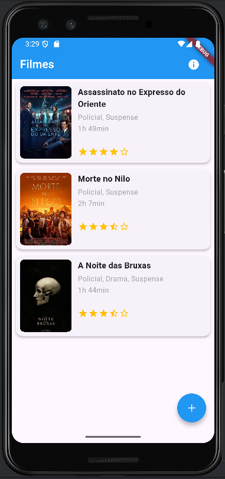
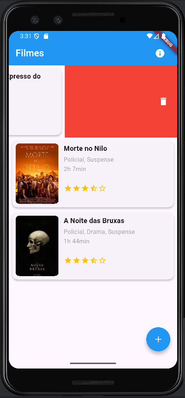
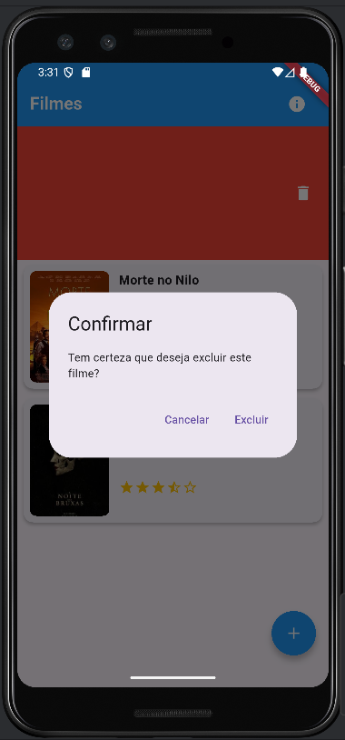
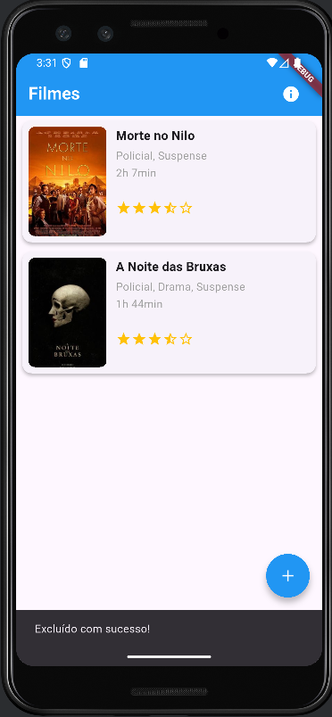
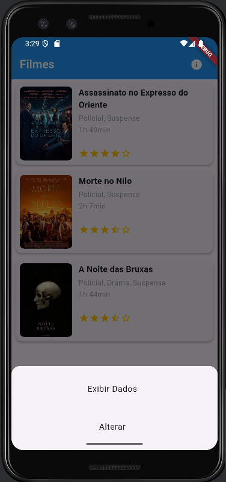
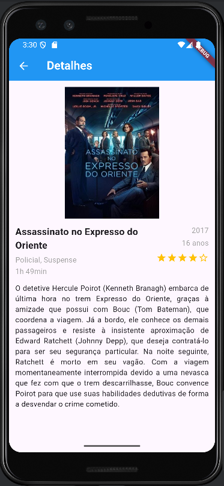
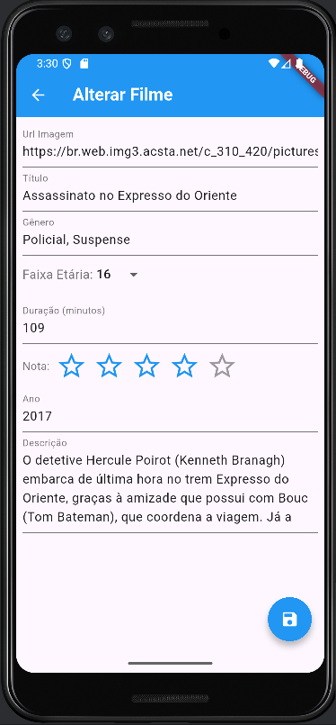

# 🎬 Catálogo de Filmes - CineList

Aplicativo desenvolvido como atividade final da disciplina **Programação para Dispositivos Móveis (2025.1)** do curso de CCO.

Este projeto tem como objetivo permitir o **cadastro, listagem, exibição, edição e remoção de filmes** em um banco de dados local, utilizando o Flutter e SQLite.

---

## 🛠️ Funcionalidades

- ✅ Cadastro de filmes com validação de formulário
- ✅ Listagem dos filmes com imagem, título, nota e gênero
- ✅ Exibição de detalhes completos do filme
- ✅ Edição e exclusão de filmes
- ✅ Ações acessadas por menu (exibir / editar)
- ✅ Swipe para excluir (com `Dismissible`)
- ✅ Alerta com nome do grupo (ou aluno) na AppBar
- ✅ Utilização de widgets como `Image.network`, `DropdownButton`, `flutter_rating_bar`, `SmoothStarRating`, entre outros

---

## 📱 Telas Implementadas

- Tela de Cadastro de Filme
- Tela de Listagem de Filmes
- Tela de Detalhes do Filme
- Tela de Edição de Filme

---

## 🧩 Campos do Filme

- `id`: Identificador do filme
- `urlImagem`: URL da capa/poster do filme
- `titulo`: Título do filme
- `genero`: Gênero do filme
- `faixaEtaria`: Classificação indicativa (Livre, 10, 12, 14, 16, 18)
- `duracao`: Duração em minutos
- `pontuacao`: Nota de 0 a 5 estrelas
- `descricao`: Breve descrição
- `ano`: Ano de lançamento

---

## 🧪 Tecnologias Utilizadas

- **Flutter 3.32.1**
- **Dart**
- **SQLite**
- `flutter_rating_bar`
- `cupertino_icons`
- `sqflite`
- `path`

---

## 🖼️ Exemplos Visuais

<table>
     <tr>
         <td align="center">
      <strong>Tela Inicial</strong><br>
      
    </td>
    <td align="center">
      <strong>Tela de Adicionar</strong><br>
      
    </td>
       <td align="center">
      <strong>Adicionar Preenchido</strong><br>
      
    </td>
      <td align="center">
      <strong>Filme Adicionado</strong><br>
      
    </td>
    <td></td>
  </tr>
  <tr>
      <td align="center">
      <strong>Tela Inicial</strong><br>
      
    </td>
      <td align="center">
      <strong>Excluindo o Filme</strong><br>
      
    </td>
    <td align="center">
      <strong>Confirmação de Exclusão</strong><br>
      
    </td>
      <td align="center">
      <strong>Filme Excluído com Sucesso</strong><br>
      
    </td>
    <tr>
      <td align="center">
      <strong>Tela Inicial</strong><br>
      
    </td>
      <td align="center">
      <strong>Opções de Card</strong><br>
      
    </td>
      <td align="center">
      <strong>Exibindo Detalhe</strong><br>
      
    </td>
    <td align="center">
      <strong>Alterar Dados</strong><br>
      
    </td>
  </tr>
</table>

---

## 📥 Como rodar o projeto

1. Clone o repositório:
   ```bash
   git clone https://github.com/CC-UNIPE-MARLONRN/CineListApp.git
   cd CineListApp
